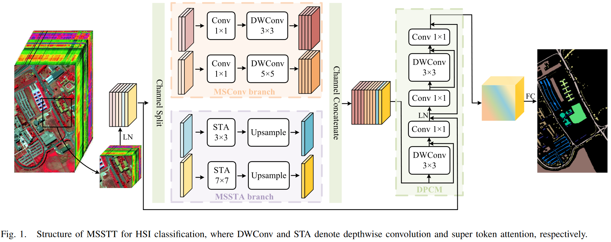
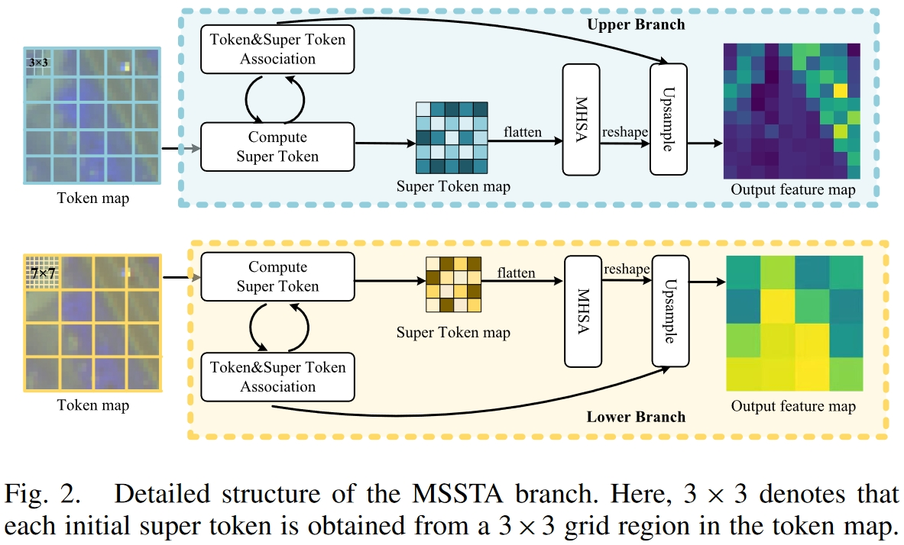

# Multiscale super token transformer for hyperspectral image classification

PyTorch implementation of Multiscale super token transformer for hyperspectral image classification.




# Basic Usage

```
import torch
from MSSTT import MSSTT
# Take the Indian Pines dataset as an example, the number of classes and spectral channels are 16 and 200, respectively.
model = MSSTT(in_chans=200, num_classes=16)
model.eval()
print(model)
input = torch.randn(100, 200, 11, 11)
y = model(input)
print(y.size())
```

# Paper

[Multiscale super token transformer for hyperspectral image classification](https://ieeexplore.ieee.org/document/10605824)

Please cite our paper if you find it useful for your research.

```
@article{meng2024multi,
  title={Multi-Scale Super Token Transformer for Hyperspectral Image Classification},
  author={Meng, Zhe and Zhang, Taizheng and Zhao, Feng and Chen, Gaige and Liang, Miaomiao},
  journal={IEEE Geoscience and Remote Sensing Letters},
  volume={21},
  pages={1--5},
  year={2024},
  publisher={IEEE}
}
```

# Reference Paper

* [Vision Transformer with Super Token Sampling](http://arxiv.org/abs/2211.11167) 

# Reference Code

* https://github.com/hhb072/SViT
